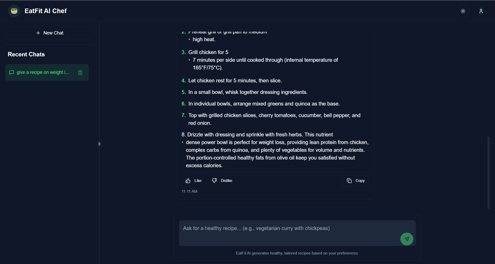
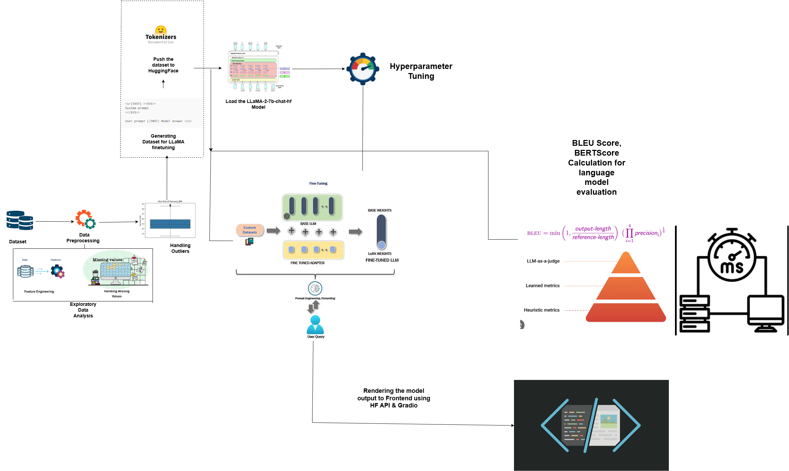

# 🍽️ EatFit
EatFit is a smart recipe generation application that leverages a fine-tuned LLaMA-2 model to produce healthy, Indian-style recipes tailored to user prompts. It uses a user feedback loop to adapt recipe diversity and tone over time.

---

## 🔥 Features

- AI-generated personalized recipes based on user prompts
- Adaptive tuning using Like/Dislike feedback
- Chat history sidebar with persistent context
- Clean and intuitive Gradio UI with dark mode support
- Designed for fast and memory-efficient inference

---
## 📊 Dataset

The dataset used for this project is a curated collection of **14,000+ Indian recipes** designed to support personalized meal generation. It contains diverse entries covering:

- **RecipeName**: Name/title of the dish.
- **Ingredients**: List of ingredients used (in raw text format).
- **PrepTime**: Time required for preparation.
- **CookTime**: Time required for cooking.
- **Servings**: Number of servings.
- **Cuisine**: Type of cuisine (e.g., South Indian, North Indian, etc.).
- **Course**: Category of the dish (e.g., breakfast, lunch, snack).
- **Diet**: Dietary tag (e.g., vegetarian, non-vegetarian, vegan).
- **Instructions**: Step-by-step cooking directions.

---

### 🔍 Source
This dataset was compiled from publicly available recipe repositories and manually validated for structure and completeness. It supports a wide variety of meal types and dietary needs.

---

### 🧹 Preprocessing
Before fine-tuning, the dataset was:
- Cleaned to remove null or malformed entries.
- Tokenized using the LLaMA-2 tokenizer.
- Augmented to enhance recipe diversity using prompt templating and formatting rules.

---

## 🖼️ UI Screenshots

> *(Login Page)*  
> 

> *(Main Page)*  
> 


---

## 🛠 Tech Stack

- **Model**: `meta-llama/LLaMA-2-7b-chat-hf`
- **LoRA Adapter**: `sanjaypn14/LLaMA-EatFit-2-7b-chat`
- **Libraries**: `transformers`, `peft`, `gradio`, `torch`
- **Interface**: Gradio Blocks
- **Deployment Target**: Localhost / Hugging Face Spaces

---

## 🚀 Getting Started

### 1. Clone the repository

```bash
git clone https://github.com/your-username/eatfit.git
cd eatfit
```

### 2. Install dependencies

```bash
pip install -r requirements.txt
```

### 3. Launch the application

```bash
python app.py
```

Open your browser at `http://localhost:7860`.

---

## 💡 How to Use

1. Enter a natural-language prompt like:
   - `"High protein breakfast for gym goers"`
   - `"Low-calorie South Indian dinner"`
2. Click **🍽️ Generate Recipe**
3. Review the ingredients and instructions
4. Use **👍 Like** or **👎 Dislike** to influence future outputs
5. View your interaction history in the left sidebar


---

## 🧠 Project Architecture

> *(Architecture)*  
> 

- **Frontend**: Gradio UI with dark mode & interactive state
- **Backend**: LLaMA-2 model with LoRA adapter
- **Dynamic Feedback**: Adjusts generation parameters using likes/dislikes

---


## 📊 Evaluation Metrics

### 🔹 **Automatic Metrics**
| Metric           | Value   |
|------------------|---------|
| BLEU Score       | 0.0000  |
| ROUGE-L Score    | 0.0465  |
| BERTScore (F1)   | 0.8213  |

### 🔹 **Inference Efficiency**
| Metric                         | Value             |
|--------------------------------|-------------------|
| Inference Time (Prompt 1)      | 16.75 seconds     |
| Inference Time (Prompt 2)      | 15.46 seconds     |

### 🔹 **Average Inference Efficiency**
| Metric              | Value            |
|---------------------|------------------|
| Avg Inference Time  | 15.48 seconds    |
| Avg Throughput      | 17.92 tokens/sec |
| Avg Latency         | 0.0559 sec/token |
| Avg Memory Usage    | 204.00 MB        |

